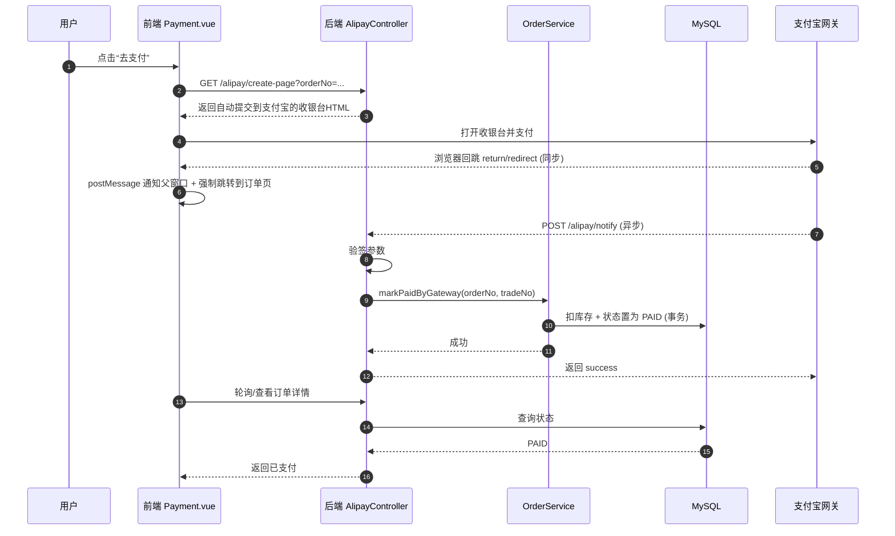

## 零食商城项目答辩讲解稿（结合PPT 实战版）

> 面向评审与观众的讲解稿。按 PPT 逻辑展开，覆盖技术选型、实现方式、为何这样做、以及端到端业务流程。所有示例均基于本仓库代码与联调经验。

---

### 1. 项目概述
- **项目定位**：面向 C 端用户的零食电商，提供浏览、购物车、下单、支付（支付宝沙箱）、发货、评价、统计等全流程能力。
- **总体架构**：前后端分离
  - 前端：Vue3 + Vite（`frontend/`）
  - 后端：Spring Boot（`src/main/java/com/example/shop/`）
  - 数据库：MySQL（`schema.sql` / `data.sql`）
  - 鉴权：JWT（用户登录后的无状态鉴权）
  - 文件存储：本地静态资源目录（`uploads/`）
  - 支付：支付宝沙箱 + ngrok（外网回调）

为什么这样选：
- Vue3 组合式 API + Vite 极快开发体验，组件化利于后续扩展。
- Spring Boot 生态成熟、与 MySQL/JPA/Security 深度融合，快速落地可靠后端。
- JWT 适合前后端分离的无状态鉴权，水平扩展友好。
- 支付宝沙箱 + ngrok 满足本地联调外网回调的真实支付流程演练。

---

### 2. 核心技术与实现

#### 2.1 Spring Boot + JPA（持久化与事务）
- 位置：`src/main/java/com/example/shop/entity/`、`repository/`、`service/`
- 实现要点：
  - 实体建模：`Order`、`OrderItem`、`Product`、`User` 等；关系映射清晰（订单-明细-商品）。
  - 统一返回结构：`Result`（代码中各 Controller 返回一致结构，便于前端消费）。
  - 事务边界：在订单相关服务（如 `OrderService.markPaidByGateway`）使用 `@Transactional`，确保“回写支付状态 + 扣库存”原子性。
- 为什么：JPA 降低样板代码，事务注解使关键流程具备一致性保障。

示例（已存在的关键方法）：
```java
// src/main/java/com/example/shop/service/OrderService.java
@Transactional
public Order markPaidByGateway(String orderNo, String tradeNo) { /* 见仓库代码 */ }
```

#### 2.2 Spring Security + JWT（鉴权）
- 位置：`security/`、`JwtAuthenticationFilter`
- 实现要点：
  - 登录成功签发 JWT，前端存储在安全位置（通常为内存/Store）。
  - 每次请求携带 `Authorization: Bearer <token>`；过滤器解析并注入 `SecurityContext`。
  - 细粒度接口权限：如管理员、商家、用户角色隔离。
- 为什么：无状态鉴权配合前后端分离，减少 Session 依赖，利于水平扩展与CDN缓存。

#### 2.3 文件上传与静态访问
- 位置：`upload` 控制器与 `uploads/` 目录
- 实现要点：MIME 校验、文件大小限制、UUID 重命名、URL 前缀映射，前端可直接用 URL 访问。
- 为什么：保证安全（防止可执行脚本）、避免冲突（UUID）、提升访问效率（静态托管）。

#### 2.4 支付宝沙箱 + ngrok（支付链路）
- 配置：`src/main/resources/application.yml` 中的 `alipay.*`（`gateway-url`、`app-id`、`merchant-private-key`、`alipay-public-key`、`notify-url`、`return-url`）。
- 控制器：`AlipayController`（`/alipay/create`、`/alipay/create-page`、`/alipay/notify`、`/alipay/return`、`/alipay/redirect`）。
- 服务：`AlipayService` 负责签名、验签与参数封装。
- 关键实现：
  - `notify`（异步）：验签成功 → `markPaidByGateway` 回写订单与扣库存 → 返回 `success`。
  - `return/redirect`（同步）：用于前端跳转体验 + postMessage 通知父窗口 + 强制跳转兜底，并附带 `ngrok-skip-browser-warning` 与禁缓存响应头，最大程度绕过“Visit Site”。
- 为什么：
  - 沙箱提供真实的支付链路体验；
  - `notify` 可靠（支付宝会重试），作为状态回写的“唯一真源”；
  - `return/redirect` 提升用户体验与可见性，前端能迅速到达订单页；
  - `ngrok` 让本地服务具备公网可达，支持支付宝回调。

前端配合：`frontend/src/views/Payment.vue`
- `window.open` 打开收银台；
- 监听 `postMessage` 接收 `ALIPAY_PAYMENT_SUCCESS`；
- 开启轮询查询订单状态作为兜底；
- 提供“手动检查状态”按钮，进一步兜底。

#### 2.5 Postman 自动化测试
- 集合：`零食商城_Postman测试集合_终极版.json`
- 规范：环境变量（域名、token、id）、预置脚本设置 token、测试脚本断言响应结构与业务值。
- 为什么：
  - 快速回归；
  - 团队共享测试基线；
  - 与 CI 集成具备可行性。

---

### 3. 端到端业务流程解说（对应 PPT 绿框业务流程图）

#### 3.1 用户侧主流程
1) 浏览/搜索商品 → 选中规格 → 加入购物车
- 接口：`/products/public/list`、`/cart/add`
- 说明：购物车明细与用户绑定，支持多端一致。

2) 创建订单
- 接口：`/orders/create`
- 关键：校验库存、快照价格、生成 `orderNo`。

3) 选择支付方式 → 打开收银台（支付宝）
- 接口：`/alipay/create-page?orderNo=...`
- 行为：后端生成自动提交到支付宝网关的 HTML；前端在新窗口打开。

4) 支付成功回跳
- 同步：`/alipay/return` 或 `/alipay/redirect` 返回 HTML，脚本会 `postMessage` + 强制跳转到 `orders?paid=1&orderNo=...`。
- 异步：`/alipay/notify` 由支付宝触发，后端验签并回写订单 `PAID`、扣库存（事务）。

5) 订单状态=PAID → 发货 → 用户确认收货 → 评价
- 接口：`/orders/ship`（商家）、`/orders/confirm`（用户）、`/reviews/create`（用户）。
- 管理：商家/管理员可查看订单流转、销量与统计。

#### 3.2 支付宝沙箱分支详解（PPT 下方“支付宝沙箱”泳道）
- 收银台 → notify 异步通知：
  - 支付宝以服务器到服务器方式回调 `notify-url`；
  - 我们在后端：验签→校验状态→`markPaidByGateway`（事务：扣库存+置 PAID）→ 返回 `success`；
  - 失败时支付宝会重试，保障最终一致性。
- 收银台 → return 同步回跳：
  - 浏览器跳回我们的 `return-url` 或 `redirect`；
  - 返回一段 HTML，先 `postMessage` 给父窗口刷新订单，再强制跳到前端订单页；
  - 响应头加 `ngrok-skip-browser-warning` 与禁缓存，绕过提示页与缓存问题；
  - 即使同步失败，异步 notify 仍能保证最终状态回写，前端轮询亦会感知。

---

### 4. 关键代码与防坑经验

- 幂等性：`markPaidByGateway` 对 `PAID/SHIPPED/FINISHED` 直接返回，避免重复扣库存。（原因：支付宝重试/多次回调、用户多次刷新）
- 事务顺序：先扣库存再置状态，或在同一事务内保证一致性（具体实现以仓库代码为准）。
- ngrok 变更：每次启动 ngrok 都会产生新域名，必须更新 `application.yml` 的 `notify-url` 与 `return-url` 并重启后端；旧订单绑定旧域名，勿复用旧单调试。
- 同步回跳卡“Visit Site”：在 `return/redirect` 响应里加 `ngrok-skip-browser-warning`、禁缓存，并采用 `window.top.location`/`opener.location` 强制跳转，减少用户手动点击。
- 前端兜底：
  - `postMessage` 通知父页；
  - 轮询 `GET /orders/{orderNo}` 状态；
  - 手动“检查状态”按钮；
  - 保障支付完成后用户几乎总能看到“已支付”。
- Postman 常见坑：
  - 变量作用域导致 `jsonData is not defined`（已修复）；
  - 创建订单需传 `cartItemIds` 数组；
  - 用例之间通过 `pm.environment.set` 传递 ID 与 token。

---

### 5. 为什么这些技术适配本项目
- 前后端分离 + JWT：减少粘连、易于扩展；移动端/小程序后续可直接复用后端。
- Spring 生态：支付、存储、安全、日志一站式集成，团队上手快。
- 支付宝沙箱：低成本模拟真实支付闭环，支持重试的异步回调天然适合“最终一致”。
- ngrok：本地研发阶段必须品，解决“公网回调”刚需。
- Postman：把业务流程用例化，演示、回归两不误。

---

### 6. 演示脚本（可直接照读）
1) 登录获取 token（Postman 或前端登录页）。
2) 选择商品加入购物车，创建订单，复制 `orderNo`。
3) 打开支付页（新窗口），完成支付。
4) 观察后端日志 `notify` 命中并返回 `success`；
5) 浏览器自动跳回订单页（如遇提示页也会在 2s 内强制跳转）；
6) 订单状态显示“已支付”，库存减少；
7) 管理端发货，用户确认收货并评价；
8) 展示统计页（销量/订单数等）。

---

### 7. 未来优化
- Webhook 重试与签名监控面板化；
- 消息队列化订单事件（支付成功、发货、评价）以解耦统计聚合；
- 前端服务端渲染/预渲染，提升首屏；
- 接入对象存储（OSS）替代本地上传，提升可用性与带宽。

---

### 附：相关文件速查
- 后端配置：`src/main/resources/application.yml`
- 支付控制器：`src/main/java/com/example/shop/controller/AlipayController.java`
- 订单服务：`src/main/java/com/example/shop/service/OrderService.java`
- 前端支付页：`frontend/src/views/Payment.vue`
- Postman 集合：`零食商城_Postman测试集合_终极版.json`

---

### 8. 项目数据流向图（可直接放入 PPT）

#### 8.1 全局数据流（端到端）
```mermaid
flowchart LR
  A[用户浏览器] --> B[前端 Views 页面\n如 Home/Products/Payment/Orders]
  B --> C[前端 API 模块\nfrontend/src/api/*]
  C -->|HTTP(JSON/Multipart)| D[后端 Controller\n如 Product/Order/Alipay]
  D --> E[Service 业务层\n事务/校验/聚合]
  E --> F[Repository/JPA]
  F --> G[(MySQL 数据库)]

  subgraph 支付回调
    H[支付宝网关] --> I[/alipay/notify 异步/]
    I --> D
    I -.返回success/重试机制.-> H
    H --> J[/alipay/return 或 /alipay/redirect 同步/]
    J --> B
  end

  subgraph 静态资源
    K[上传控制器 Upload] --> L[uploads/ 静态目录]
    B -->|图片URL| L
  end

  subgraph 鉴权
    B -->|携带JWT| D
    D -->|签发/校验| M[JWT 令牌]
  end

  style B fill:#E8F5E9,stroke:#2E7D32
  style D fill:#E3F2FD,stroke:#1565C0
  style E fill:#EDE7F6,stroke:#5E35B1
  style G fill:#FFF3E0,stroke:#EF6C00
  style H fill:#FFFDE7,stroke:#F9A825
```

要点：
- 用户操作在 Views 中触发，调用 API 模块；
- Controller 只做输入输出和权限校验，核心在 Service；
- Service 在事务内协调 Repository，读写 MySQL；
- 支付閉环由支付宝网关触发 notify/return，最终状态以 notify 为准；
- 文件上传落地到 `uploads/`，前端用 URL 直链展示；
- 全链路通过 JWT 无状态鉴权。

#### 8.2 支付宝支付闭环（时序图）


投放建议：
- 在 PPT 中放一张“全局数据流”+ 一张“支付闭环时序图”，对应到演示脚本第 3～6 步。
- 如需 SVG 导出，可用支持 Mermaid 的编辑器（VSCode + Mermaid 插件 / Obsidian / Typora）渲染后导出。
